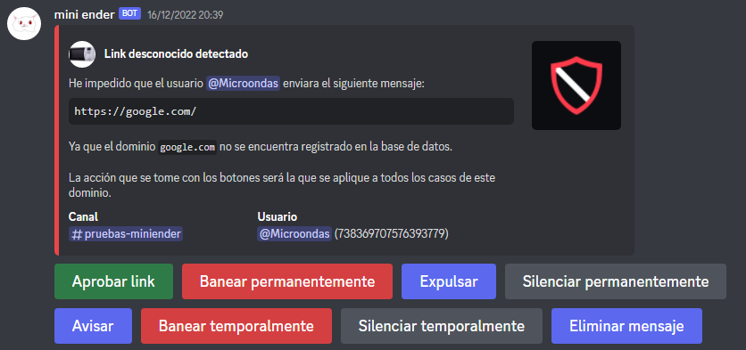

# 🔗 Antilinks

Este sub-módulo de **Sentinel** evita el envío de cualquier tipo de link a cualquier canal de texto dentro de un servidor de Discord.


Esta función requiere leer cada mensaje, y para ello es recomendado hacer uso de Redis si se quiere hacer [self-hosting](../introduccion/self-hosting.md)


## Funcionamiento

Cada vez que un usuario envía un mensaje que contiene un link, el sistema de anti-link se activa, y dependiendo de las condiciones se llevan acabo las acciones necesarias

#### Un nuevo link

Cuando un usuario envía un link que aun no ha sido revisado, el bot enviará un mensaje al canal configurado con toda la información del mensaje y del link y borrará el mensaje. Cualquiera con acceso a ese canal puede usar los botones del mensaje para elegir que acción se va a lleva a cabo si ese link vuelve a aparecer en cualquier otro mensaje.

El usuario recibirá un mensaje por MD personalizado, especificado en el campo `anti_links_new_link` en el módulo `messages`.

<figure><figcaption></figcaption></figure>

#### Un link bajo revisión

Cuando un usuario manda un link que aun se encuentra bajo revisión, el mensaje se borrará y al usuario se le notificará por MD con un mensaje personalizado, especificado en el campo `anti_links_under_revision` en el módulo de `messages`.

#### Un link conocido

Cuando un usuario manda un link conocido, significa que un moderador ya ha decidido una acción a realizar si ese dominio se envía, por lo que el usuario recibirá la sanción elegida y se le notificará por MD con un mensaje personalizado, especificado en el campo `anti_links_sanction` en el módulo de `messages`.

## Configuración

El sistema de anti-links se configura bajo el módulo de `anti_links` en el archivo de configuración, para habilitarlo simplemente cambia `enabled` a `true` y establece la ID del canal de texto por el que se enviarán los mensajes del sistema en el campo `channel_id`.

#### Ignorar links/roles/canales

Para ignorar siempre un link, se debe de añadir a la lista del campo de `allowed_links` dentro del módulo de `anti_links`. Por ejemplo, el dominio `twitch.tv` puede estar sancionado con un aviso, pero si el link `twitch.tv/ibai` se ignora, solo se avisarán a los usuarios que manden un link de dicho domino que no es `twitch.tv/ibai`.

Ejemplo:

```yaml
allowed_links: ["twitch.tv/ibai", "discord.gg/ibai"]
```

Para ignorar un rol o un canal de texto se usará el mismo formato, estableciendo las IDs dentro de la lista de esta manera:

```yaml
ignore_roles: ["874451564092358696", "418586876899885056"]
ignore_channels: ["705554757690851378", "1068326121856311336"]
```

## Anti-phishing

El sistema de anti-phishing es una colección de **8732** links que se saben al 100% que son dedicados al phishing, y cualquier usuario que envíe un link incluido en esa lista será baneado de manera instantánea. Puedes ver estos links [aquí](https://github.com/holasoyender/mini-ender/blob/main/src/main/resources/phishing.json).

## Modificar un dominio

Se puede modificar o eliminar la acción decidida para un dominio usando el comando `link` con el siguiente formato: `link <dominio>`.

Este comando también da información a cerca del dominio, como cuantas veces ha aparecido o la fecha del bloqueo,

&#x20;
