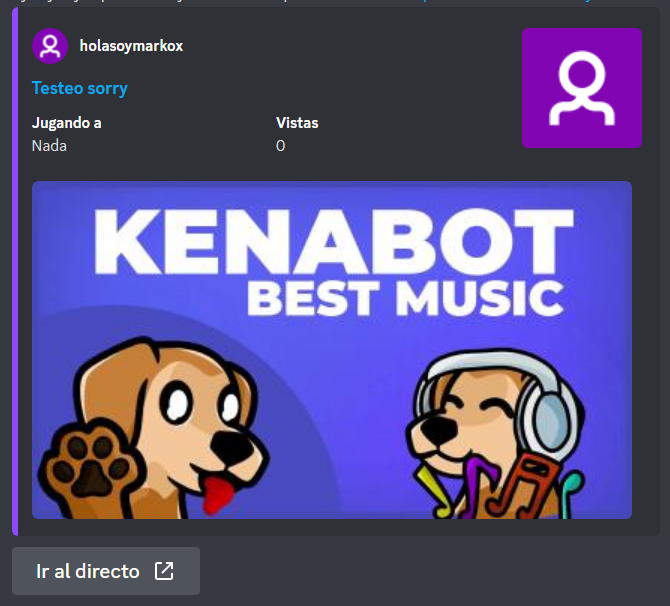

# Integración con Twitch

Mini ender cuenta con un sistema de notificación de directos de Twitch, principalmente pensado para las necesidades del servidor de **Discord** de Ibai


Todos los sub-módulos de este proyecto están en constante desarrollo y sujetos a cambios


### Notificación de inicio de directo por un canal

En el archivo de configuración puedes especificar en el módulo de Twitch un canal y un mensaje para notificar a los usuarios del inicio de un stream, para ello se debe de rellenar el campo `channel` el nombre de usuario del streamer de Twitch, en `announce_channel_id` la ID del canal de texto por el que se enviará el mensaje, y por ultimo en `message` el mensaje que se enviará al canal.

El mensaje se enviará siempre con un embed con botones, por lo que no es necesario especificar la URL del directo, se pueden usar variables para personalizar el mensaje con información del directo, estas son las siguientes:

```
{streamer} - Nombre del streamer
{title} - Título del directo, si no hay título será "Sin título"
{game} - Nombre del juego, si no esta jugando a nada será "Nada"
{url} - Link al directo
{thumbnail} - Link de la miniatura estática del directo
```

El embed por defecto se verá así:

<figure><figcaption></figcaption></figure>

### Canal para abrir/cerrar

La otra funcionalidad de esta integración es la habilidad de poder abrir y cerrar un canal de texto cuando un streamer inicia o acaba un directo. Para activar esta función se debe de rellenar el campo `live_channel_id` en el módulo de Twitch con la ID del canal de texto a abrir/cerrar. Esta función tan solo quita y pone el permiso de mandar mensajes al rol `@everyone`, a la vez que manda un mensaje personalizado especificado en el campo `live_open_message` al iniciar y otro mensaje personalizado en el campo `live_close_message` al acabar.

Las variables para estos mensajes son las mismas que las de la funcionalidad de avisar por un canal

